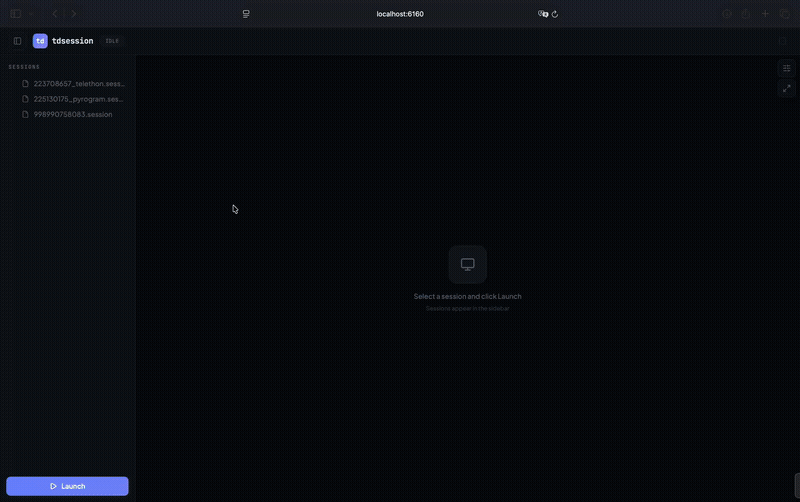

# tdsession

> Multi-session Telegram Desktop viewer — launch and manage multiple Telegram accounts simultaneously through your browser via Docker. Supports Telethon, Pyrogram, and Kurigram session formats.

[](#quick-start)
[](LICENSE)
[](#requirements)



## Features

- **Multi-account** — up to 10 simultaneous Telegram Desktop sessions with tab switching
- **Auto-detect** — Telethon, Pyrogram, Kurigram `.session` formats recognized automatically
- **Live updates** — new session files appear instantly via filesystem watcher
- **Shared folder** — exchange files between host and VNC sessions
- **Clipboard** — seamless copy/paste between host and VNC (Chrome/Edge)
- **Fullscreen** — hide sidebar and tabs for a clean view

## Quick Start

```bash
git clone https://github.com/maryny4/tdsession.git
cd tdsession
cp .env.example .env
docker compose up -d
```

Open **http://localhost:6160** and drop your `.session` files into `sessions/`.

## Project Structure

```
tdsession/
├── docker-compose.yml     # Run configuration
├── .env                   # WEB_PORT, MAX_SESSIONS, VNC_RESOLUTION
├── sessions/              # Your .session files (subfolders supported)
├── shared/                # File exchange with VNC sessions
└── src/                   # Application source
```

## Usage

| Action | How |
|--------|-----|
| **Add sessions** | Drop `.session` files into `sessions/` — they appear instantly |
| **Launch** | Select a session → click **Launch** |
| **Switch** | Click tabs to switch between sessions |
| **Fullscreen** | Hover VNC area → maximize icon (top right) |
| **Sidebar** | Toggle via panel icon in the top bar |
| **Share files** | `shared/` folder → "Shared" bookmark in VNC file dialogs |
| **Stop** | ✕ on a tab, or **Stop All** |

## Clipboard

| Browser | Method |
|---------|--------|
| Chrome / Edge | Seamless — works automatically. Click canvas once after tab switch. |
| Safari / Firefox | Use KasmVNC clipboard panel (sliders icon in VNC toolbar) |

## Session Formats

| Format | Detection | First Launch |
|--------|-----------|-------------|
| Pyrogram | `test_mode` + `user_id` | Offline |
| Kurigram | `server_address` + `api_id` | Offline |
| Telethon | `server_address` only | Needs internet once |

Converted tdata is cached inside the container. Cache invalidates when the source file changes.

## Configuration

```env
WEB_PORT=6160              # Web UI port
MAX_SESSIONS=10            # Max concurrent sessions
VNC_RESOLUTION=1920x1080   # Initial VNC resolution
```

~170 MB RAM per session. To persist cache across rebuilds, add `- ./data:/app/data` to volumes.

## Architecture

```
Browser → FastAPI :6160
            ├── /api/*          → Session Manager
            ├── /vnc/{id}/*     → HTTP proxy → Xvnc :100+N
            └── /vnc/{id}/ws    → WS proxy  → Xvnc :100+N
```

Each session: **Xvnc** (display + VNC) → **Fluxbox** (WM) → **Telegram Desktop** (tdata)

## Requirements

- Docker + Docker Compose
- x86_64 recommended (ARM works via emulation)

## License

MIT
